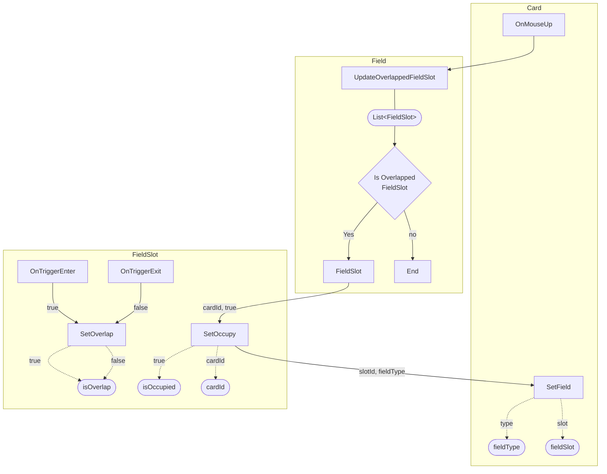
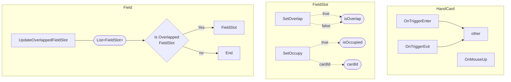

유니티 버전 2022.3.34f1
# 핸드 카드 동작

```mermaid
flowchart TB
    subgraph Card
    OnMouseUp
    SetField -. type .-> fieldType
    SetField -. slot .-> fieldSlot
    fieldType([ fieldType ])
    fieldSlot([ fieldSlot ])
    end
    subgraph Field
    UpdateOverlappedFieldSlot --- slots
    slots([ List#lt;FieldSlot#gt; ])
    slots --> find{ Is Overlapped<br>FieldSlot }
    find -- Yes --> found[ FieldSlot ]
    find -- no --> End
    end
    subgraph FieldSlot
    SetOverlap-. true .-> overlap
    SetOverlap-. false .-> overlap
    overlap([ isOverlap ])
    SetOccupy-. true .-> occupy
    SetOccupy-. cardId .-> cardId
    occupy([ isOccupied ])
    cardId([ cardId ])
    OnTriggerEnter-- true -->SetOverlap
    OnTriggerExit-- false -->SetOverlap
    end
    OnMouseUp-->UpdateOverlappedFieldSlot
    found -- "cardId, true" --> SetOccupy
    SetOccupy -- "slotId, fieldType" --> SetField
```
# 2번째

```mermaid
flowchart TB
    subgraph HandCard
    OnTriggerEnter --> other
    OnTriggerExit --> other
    OnMouseUp
    end

    subgraph FieldSlot
    SetOverlap-. true .-> overlap
    SetOverlap-. false .-> overlap
    overlap([ isOverlap ])
    SetOccupy-. true .-> occupy
    SetOccupy-. cardId .-> cardId
    occupy([ isOccupied ])
    cardId([ cardId ])
    end

    subgraph Field
    UpdateOverlappedFieldSlot --- slots
    slots([ List#lt;FieldSlot#gt; ])
    slots --> find{ Is Overlapped<br>FieldSlot }
    find -- Yes --> found[ FieldSlot ]
    find -- no --> End
    end
```