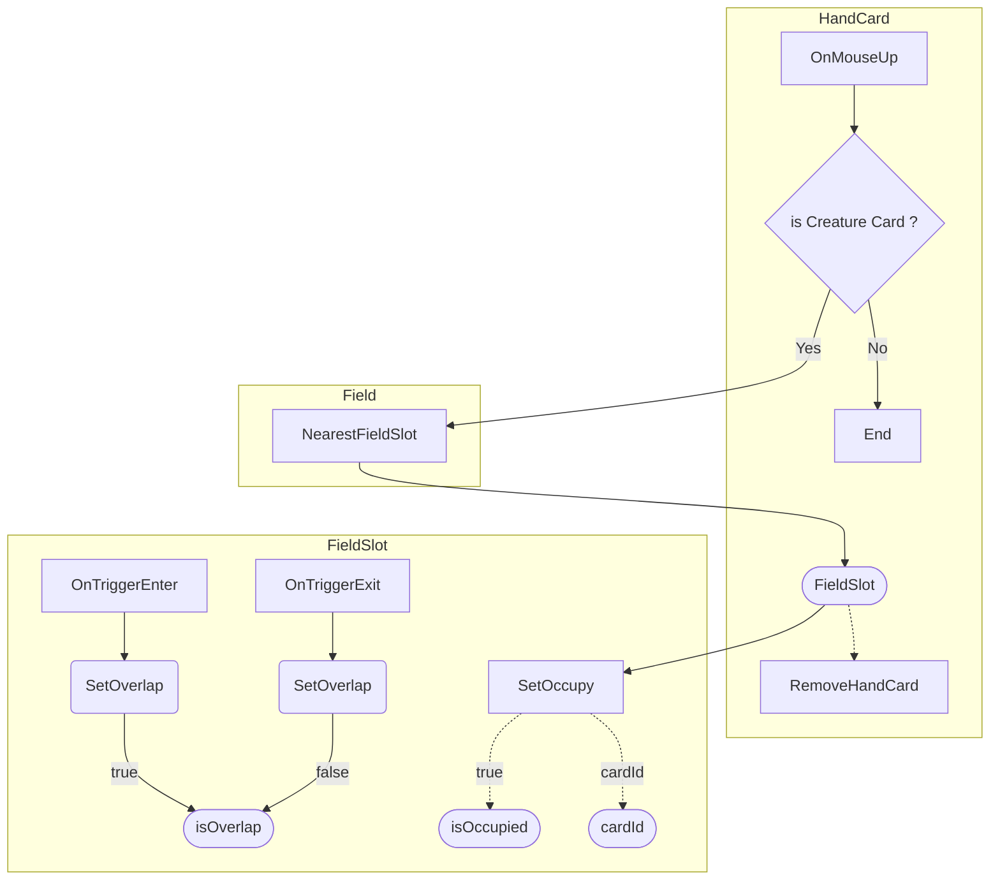
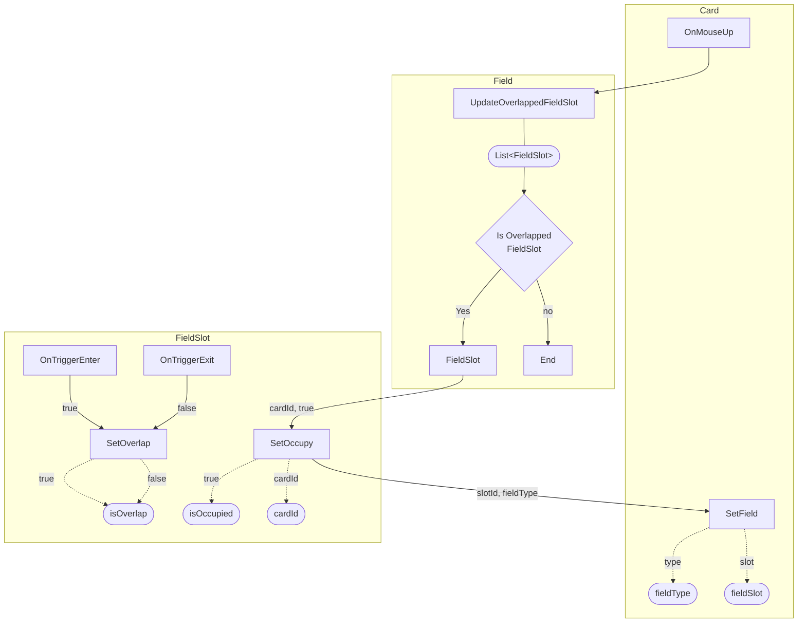
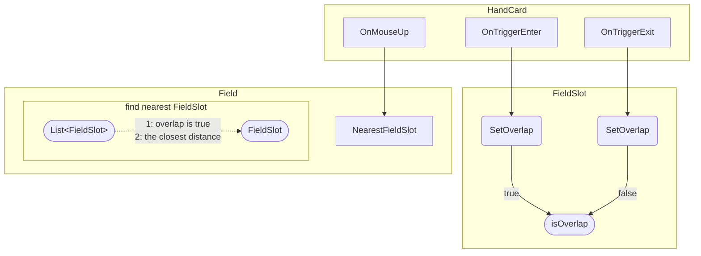

유니티 버전 2022.3.34f1
# 핸드 카드 동작
# 3번째

```mermaid
flowchart TB
    subgraph HandCard
        OnMouseUp --> cardType{ is Creature Card ? }
        cardType -- No --> End
        found([ FieldSlot ])
        found -.-> RemoveHandCard
    end
    subgraph FieldSlot
        OnTriggerEnter-->overlapped
        OnTriggerExit-->separated
        overlapped( SetOverlap ) -- true --> overlapValue
        separated( SetOverlap ) -- false --> overlapValue
        overlapValue([ isOverlap ])
        SetOccupy-. true .-> occupy
        SetOccupy-. cardId .-> cardId
        occupy([ isOccupied ])
        cardId([ cardId ])
    end
    subgraph Field
        NearestFieldSlot
    end
    cardType -- Yes --> NearestFieldSlot
    NearestFieldSlot --> found([ FieldSlot ])
    found --> SetOccupy
```
# 1번째

```mermaid
flowchart TB
    subgraph Card
    OnMouseUp
        SetField -. type .-> fieldType
        SetField -. slot .-> fieldSlot
        fieldType([ fieldType ])
        fieldSlot([ fieldSlot ])
    end
    subgraph Field
        UpdateOverlappedFieldSlot --- slots
        slots([ List#lt;FieldSlot#gt; ])
        slots --> find{ Is Overlapped<br>FieldSlot }
        find -- Yes --> found[ FieldSlot ]
        find -- no --> End
    end
    subgraph FieldSlot
        SetOverlap-. true .-> overlap
        SetOverlap-. false .-> overlap
        overlap([ isOverlap ])
        SetOccupy-. true .-> occupy
        SetOccupy-. cardId .-> cardId
        occupy([ isOccupied ])
        cardId([ cardId ])
        OnTriggerEnter-- true -->SetOverlap
        OnTriggerExit-- false -->SetOverlap
    end
    OnMouseUp-->UpdateOverlappedFieldSlot
    found -- "cardId, true" --> SetOccupy
    SetOccupy -- "slotId, fieldType" --> SetField
```
# 2번째

```mermaid
flowchart TB
    subgraph HandCard
        OnTriggerEnter
        OnTriggerExit
        OnMouseUp
    end
    subgraph FieldSlot
        overlapped( SetOverlap ) -- true --> overlapValue
        separated( SetOverlap ) -- false --> overlapValue
        overlapValue([ isOverlap ])
    end
    subgraph Field
        NearestFieldSlot
        subgraph find nearest FieldSlot
            slots([ List#lt;FieldSlot#gt; ]) -. 1: overlap is true <br> 2: the closest distance .-> found
        end
        found([ FieldSlot ])
    end
    OnTriggerEnter --> overlapped
    OnTriggerExit --> separated
    OnMouseUp --> NearestFieldSlot
```