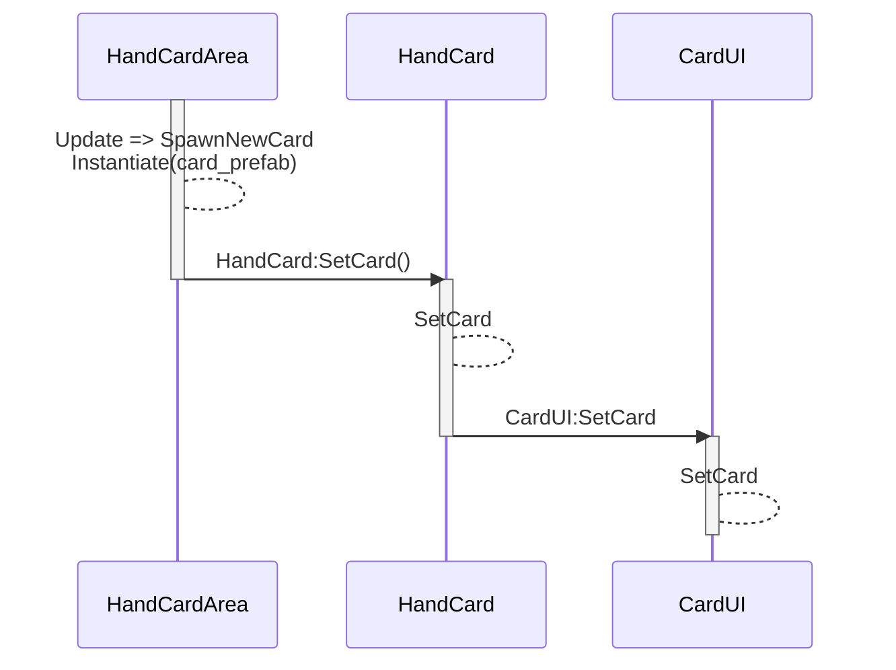

유니티 버전 2022.3.34f1

# TCG 엔진 로그라이크
핸드 카드 생성

```mermaid
sequenceDiagram
    participant BattleUI
    BattleUI->>GameClient: EndTurn
    GameClient->>BattleLogic: NextStep
    BattleLogic->>BattleLogic: EndTurn
    BattleLogic-->BattleLogic: RemoveFromInitiativeCurrent (배틀 순서 초상화 지우기)
    BattleLogic->>BattleLogic: StartTurn