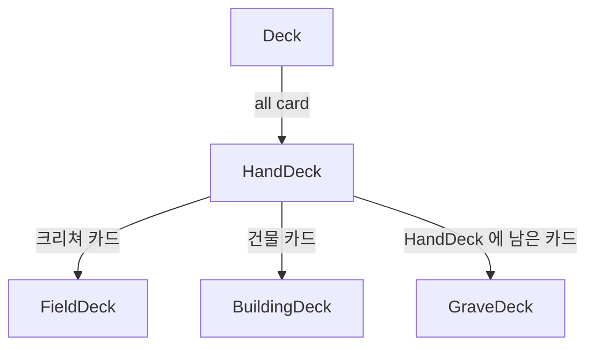
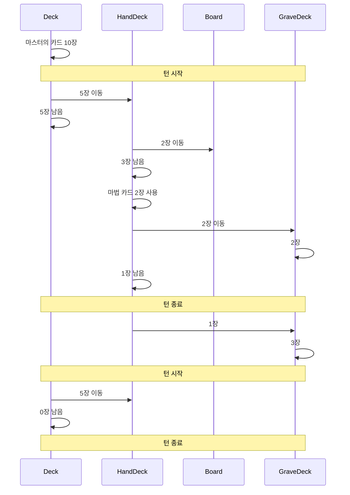

유니티 버전 2022.3.34f1
# 카드 이동

```mermaid
flowchart TB
    Deck -- all card --> HandDeck
    HandDeck -- 크리쳐 카드 --> FieldDeck
    HandDeck -- 건물 카드 --> BuildingDeck
    HandDeck -- HandDeck 에 남은 카드 --> GraveDeck
    FieldDeck
    BuildingDeck
    GraveDeck
```

```mermaid
sequenceDiagram
    participant Deck
    participant HandDeck
    participant Board
    participant GraveDeck
    Deck ->> Deck: 마스터의 카드 10장
    Note over Deck,GraveDeck: 턴 시작
    Deck ->> HandDeck: 5장 이동
    Deck ->> Deck: 5장 남음
    HandDeck ->> Board: 2장 이동
    HandDeck ->> HandDeck: 3장 남음
    HandDeck ->> HandDeck: 마법 카드 2장 사용
    HandDeck ->> GraveDeck: 2장 이동
    GraveDeck ->> GraveDeck: 2장
    HandDeck ->> HandDeck: 1장 남음
    Note over Deck,GraveDeck: 턴 종료
    HandDeck ->> GraveDeck: 1장
    GraveDeck ->> GraveDeck: 3장
    Note over Deck,GraveDeck: 턴 시작
    Deck ->> HandDeck: 5장 이동
    Deck ->> Deck: 0장 남음
    Note over Deck,GraveDeck: 턴 종료
```