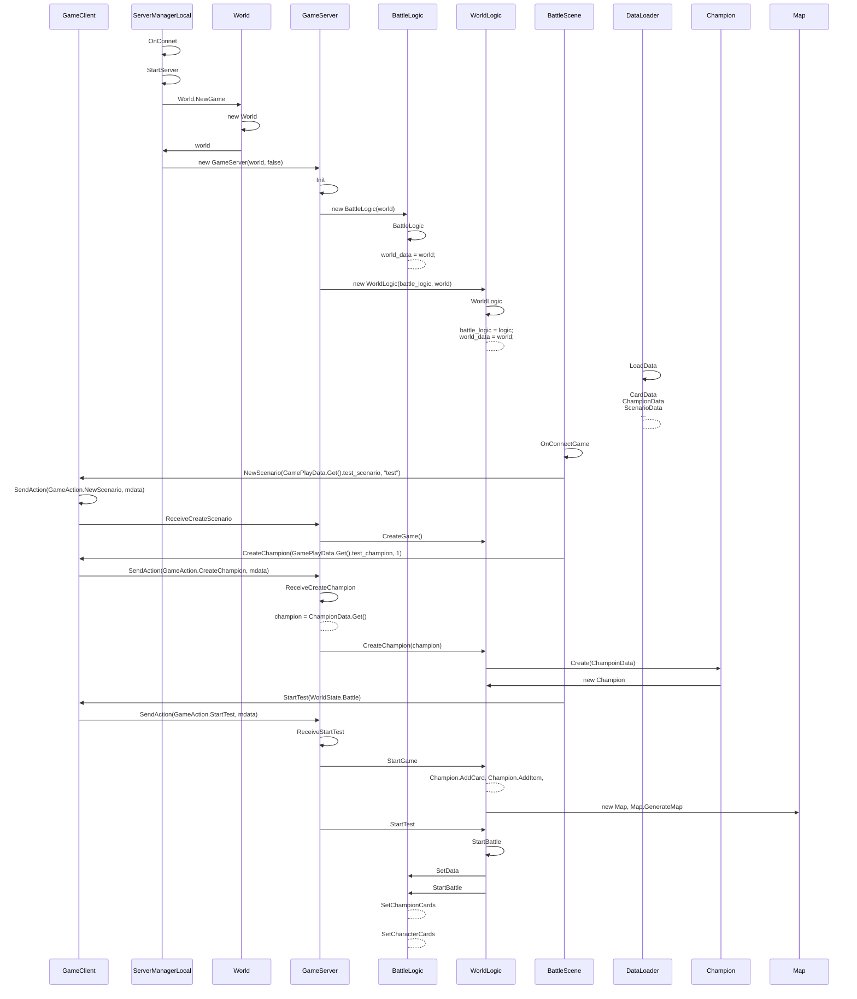

# 전체 흐름

```mermaid
sequenceDiagram
    participant GameClient
    participant ServerManagerLocal
    ServerManagerLocal->>ServerManagerLocal: OnConnet
    ServerManagerLocal->>ServerManagerLocal: StartServer
    ServerManagerLocal->>World: World.NewGame
    participant World
    World->>World: new World
    World->>ServerManagerLocal: world
    ServerManagerLocal->>GameServer: new GameServer(world, false)
    participant GameServer
    GameServer->>GameServer: Init
    GameServer->>BattleLogic: new BattleLogic(world)
    BattleLogic->>BattleLogic: BattleLogic
    BattleLogic-->BattleLogic: world_data = world#59;
    GameServer->>WorldLogic: new WorldLogic(battle_logic, world)
    WorldLogic->>WorldLogic: WorldLogic
    WorldLogic-->WorldLogic: battle_logic = logic#59;<br>world_data = world#59;
    participant BattleScene
    participant DataLoader
    DataLoader->>DataLoader: LoadData
    DataLoader-->DataLoader: CardData<br>ChampionData<br>ScenarioData<br>...
    BattleScene->>BattleScene: OnConnectGame
    BattleScene->>GameClient: NewScenario(GamePlayData.Get().test_scenario, "test")
    GameClient->>GameClient: SendAction(GameAction.NewScenario, mdata)
    GameClient->>GameServer: ReceiveCreateScenario
    GameServer->>WorldLogic: CreateGame()
    BattleScene->>GameClient: CreateChampion(GamePlayData.Get().test_champion, 1)
    GameClient->>GameServer: SendAction(GameAction.CreateChampion, mdata)
    GameServer->>GameServer: ReceiveCreateChampion
    GameServer-->GameServer: champion = ChampionData.Get()
    GameServer->>WorldLogic: CreateChampion(champion)
    WorldLogic->>Champion: Create(ChampoinData)
    Champion->>WorldLogic: new Champion
    BattleScene->>GameClient: StartTest(WorldState.Battle)
    GameClient->>GameServer: SendAction(GameAction.StartTest, mdata)
    GameServer->>GameServer: ReceiveStartTest
    GameServer->>WorldLogic: StartGame
    WorldLogic-->WorldLogic: Champion.AddCard, Champion.AddItem,
    WorldLogic->>Map: new Map, Map.GenerateMap
    GameServer->>WorldLogic: StartTest
    WorldLogic->>WorldLogic: StartBattle
    WorldLogic->>BattleLogic: SetData
    WorldLogic->>BattleLogic: StartBattle
    BattleLogic-->BattleLogic: SetChampionCards
    BattleLogic-->BattleLogic: SetCharacterCards
```