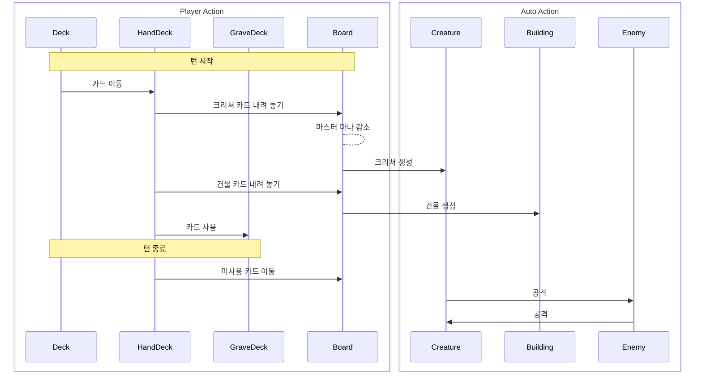

# 전체 흐름

```mermaid
sequenceDiagram
    box Player Action
    participant Deck
    participant HandDeck
    participant GraveDeck
    participant Board
    End
    Note over Deck,Board: 턴 시작
    Deck ->> HandDeck: 카드 이동
    HandDeck ->> Board: 크리쳐 카드 내려 놓기
    Board --> Board: 마스터 마나 감소
    Board ->> Creature: 크리쳐 생성
    HandDeck ->> Board: 건물 카드 내려 놓기
    Board ->> Building: 건물 생성
    HandDeck ->> GraveDeck: 카드 사용
    Note over Deck,GraveDeck: 턴 종료
    HandDeck ->> Board: 미사용 카드 이동
    box Auto Action
    participant Creature
    participant Building
    participant Enemy
    end
    Creature ->> Enemy: 공격
    Enemy ->> Creature: 공격
```