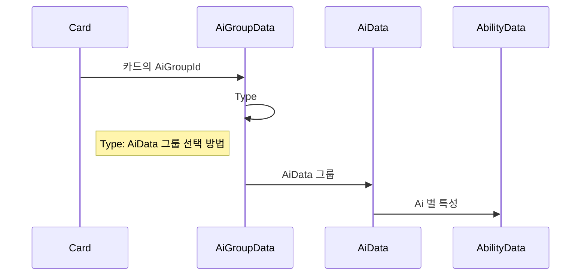

유니티 버전 2022.3.34f1
# 턴 종료 후 크리쳐, 몬스터 카드 액션

```mermaid
sequenceDiagram
    participant Card
    participant AiGroupData
    participant AiData
    participant AbilityData
    Card ->> AiGroupData: 카드의 AiGroupId
    AiGroupData ->> AiGroupData: Type
    Note left of AiGroupData: Type: AiData 그룹 선택 방법
    AiGroupData ->> AiData: AiData 그룹
    AiData ->> AbilityData: Ai 별 특성
    
```