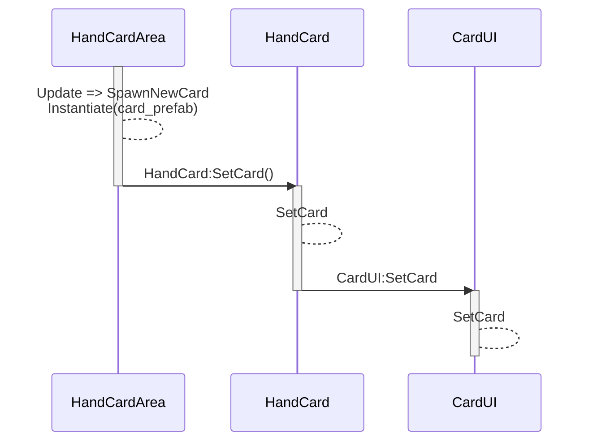
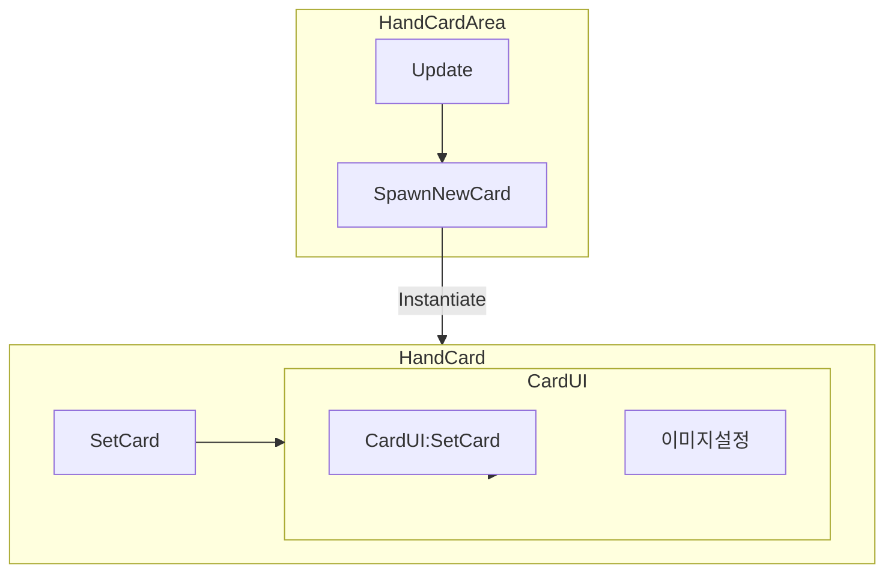

유니티 버전 2022.3.34f1

# TCG 엔진 로그라이크
핸드 카드 생성

```mermaid
sequenceDiagram
    participant HandCardArea
    activate HandCardArea
    HandCardArea-->HandCardArea: Update => SpawnNewCard<br/>Instantiate(card_prefab)
    HandCardArea->>HandCard: HandCard:SetCard()
    deactivate HandCardArea
    activate HandCard
    HandCard --> HandCard: SetCard
    HandCard ->> CardUI: CardUI:SetCard
    deactivate HandCard
    activate CardUI
    CardUI --> CardUI: SetCard
    deactivate CardUI
```

```mermaid
flowchart TB
    subgraph HandCardArea
    Update --> SpawnNewCard
    end
    SpawnNewCard -->|Instantiate| HandCard
    subgraph HandCard
    SetCard --> CardUI
    end
    subgraph CardUI
    CardUI --> CardUI:SetCard
    CardUI --> 이미지설정
    end
```