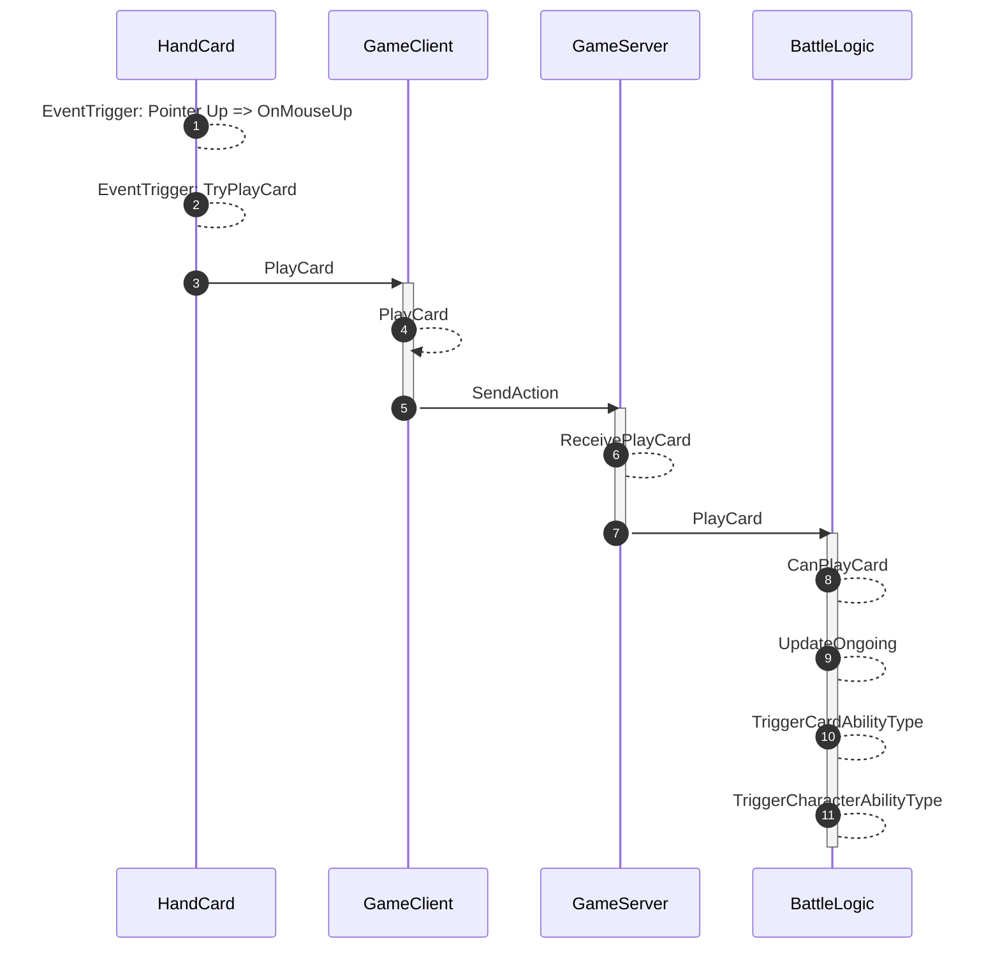
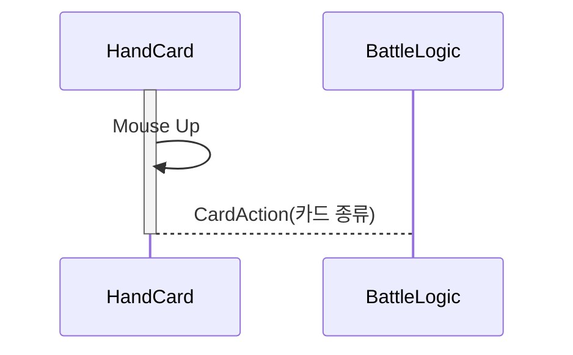

유니티 버전 2022.3.34f1

# TCG 엔진 로그라이크
핸드 카드 동작

```mermaid
sequenceDiagram
    autonumber
    participant HandCard
    HandCard-->HandCard: EventTrigger: Pointer Up => OnMouseUp
    HandCard-->HandCard: EventTrigger: TryPlayCard
    HandCard->>+GameClient: PlayCard
    GameClient-->>GameClient: PlayCard
    GameClient->>-GameServer: SendAction
    activate GameServer
    GameServer-->GameServer: ReceivePlayCard
    GameServer->>BattleLogic: PlayCard
    deactivate GameServer
    activate BattleLogic
    BattleLogic-->BattleLogic: CanPlayCard
    BattleLogic-->BattleLogic: UpdateOngoing
    BattleLogic-->BattleLogic: TriggerCardAbilityType
    BattleLogic-->BattleLogic: TriggerCharacterAbilityType
    deactivate BattleLogic
```
# ERang
핸드 카드 동작

```mermaid
sequenceDiagram
    participant HandCard
    activate HandCard
    HandCard->>HandCard: Mouse Up
    HandCard-->BattleLogic: CardAction(카드 종류)
    deactivate HandCard
```